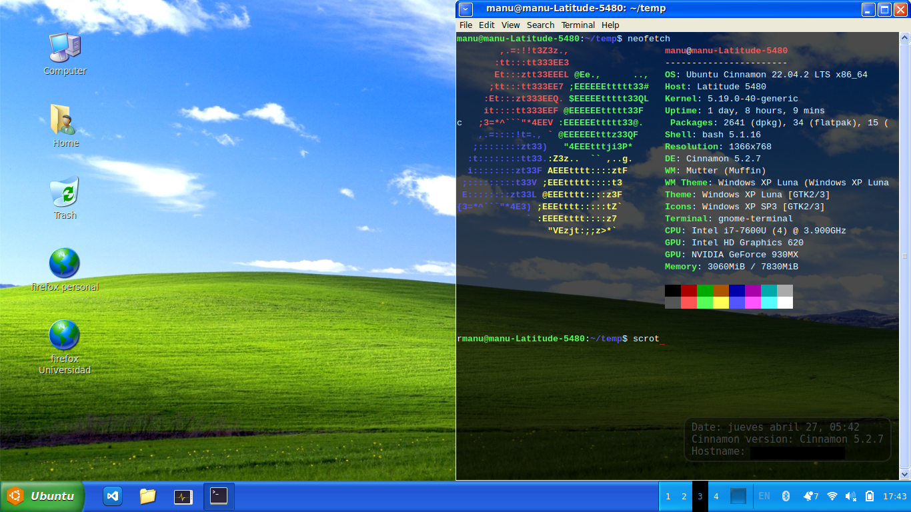

# Manuel Aguilera

## Education

Im a 19 years old CS student, right now im cursing second year in [PUCV](https://www.pucv.cl/) college. 

I have been programming since i was little, but mostly was just following tutorials in Yt to make mods of Undertale, or to make commands in minecraft.

I've made some *Interesting* projects in scratch, and some mildly complex games in there with paralax included. (With only a little help of the internet) I'd add the scratch profile but is just very cringe.

## Languages

About actual languages I can speak mostly fluent english and spanish (I speak spanish natively). 

About programing languages... 
Right now i dont have so advanced knowledge in lots of languages, but im really getting strong with C.
I've tried doing diferent projects in raw html and css, i havent uploaded them tho because most of them are pretty lame :p

I of course know some basic bash and work pretty well with the terminal, that is because..

## I really like linux!
### Here you can see my desktop enviroment on ubuntu.

### Im not good making rice, but i think it has some aesthetic to it :/

This is the Desktop Enviroment that i have installed on my laptop, wich i use to develop, and do college related stuff. I'd switch fully to ubuntu or another distro, problem is that i like playing valorant so I'm still using windows 10 on my main pc.

I'm thinking to change my OS to arch (btw)
But since im feeling really confortable in ubuntu with cinnamon, i dont think that would be such a great of an idea.

--- 

## Things i want to do

- Learning C++ : Im feeling a little tired of C, and im hoping to change to c++ in the near future. Since i really want to start making programs wich work with a gui, and the attemps i've made doing that with c had been kind of rough.

- Making some dumb programing language: I dont really know a lot about compilers, but have this project in mind that basically would be, making a compiler in c that reads a file and translates it to c, and then compiles it with c. There is probably easier ways to do this without translating to c, but im interested because that idea sounds kinda funny.

## Things im doing

Right now with college i spend most of my time studying algebra, physics, and some computer science related courses. Such as Data Structures, and Data Analisis with python. 

From there i really like math, and phyisics. Kinda hate Data Analisis, and like a lot more Data Structures!
I guess it is mostly because is in that class that i get to work on more sofisticated projects.
